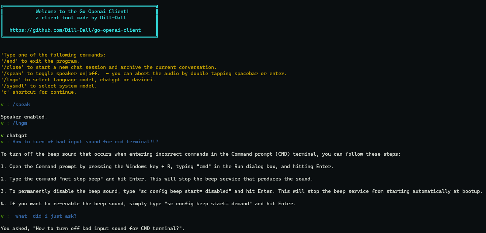

## go_openai_cli

To start the chatbot, run `go run main.go` from the project directory. You will be prompted to enter a question or message. The chatbot will generate a response using the OpenAI API and display it in the terminal.

The following commands are available:

* `/end`: Exit the chatbot
* `/close`: Start a new chat session and archive the current conversation
* `/speak`: Toggle text-to-speech output for responses
* `/lngm`: Select the language model to use (GPT or Davinci)
* `/sysmodel`: Select the system model to use (AI, Detective, DnDm, or Editor)
* `/gpt`: Select the GPT language model
* `c`: Shortcut for "continue"
* `/help`: Display the help message

Introduction
-----

This project is a command-line chatbot that uses OpenAI's API to generate responses to user queries. The chatbot is built in Go and consists of four main packages: `audio`, `openai`, `textMessages`, and `main`.

The `audio` package is responsible for creating and playing audio files that contain the AI's responses. The `openai` package handles requests and responses to and from OpenAI's API. The `textMessages` package is responsible for logging conversations and rotating logs to archive older conversations. The `main` package ties everything together, providing a command-line interface for the chatbot and user interaction.

Disclaimer: Of course the I have gotten a lot of help from the OpenAI to create this client

Usage
-----

To use the chatbot, you will need to set up an OpenAI API key and a Google Cloud service account key. Place your OpenAI API key in a file named `.env` in the root directory of the project with the following format:

```
OPENAI_API_KEY=<YOUR_API_KEY>  
GOOGLE_APPLICATION_CREDENTIALS=<GOOGLE_ACCOUNT_JSON_CREDENTIALS_LOCATION>
```

Regarding using the Google Cloud service. It should be fairly simple to extract that feature from the project, or change it into usage of an opensource project instead. I just found the quality of Google Cloud text to speak so much better.

`go run main.go`

Once the chatbot is running, you can type your queries and press Enter to send them to the AI. The chatbot will print the AI's response to the console and log the conversation to a file.

Files
-----

* `audio.go`: Creates and plays audio files containing the AI's responses
* `main.go`: Provides a command-line interface for the chatbot and user interaction
* `openai.go`: Handles requests and responses to and from OpenAI's API
* `textMessages.go`: Logs conversations and rotates logs to archive older conversations

Roadmap
---

* Voice feature for talking  back and forth with the cli without needing  input
* Maintaining log and audio files
* Error handling and Testing
* ...

License
-------

This project is licensed under the [MIT license](https://opensource.org/licenses/MIT).

Example of usage
-------


